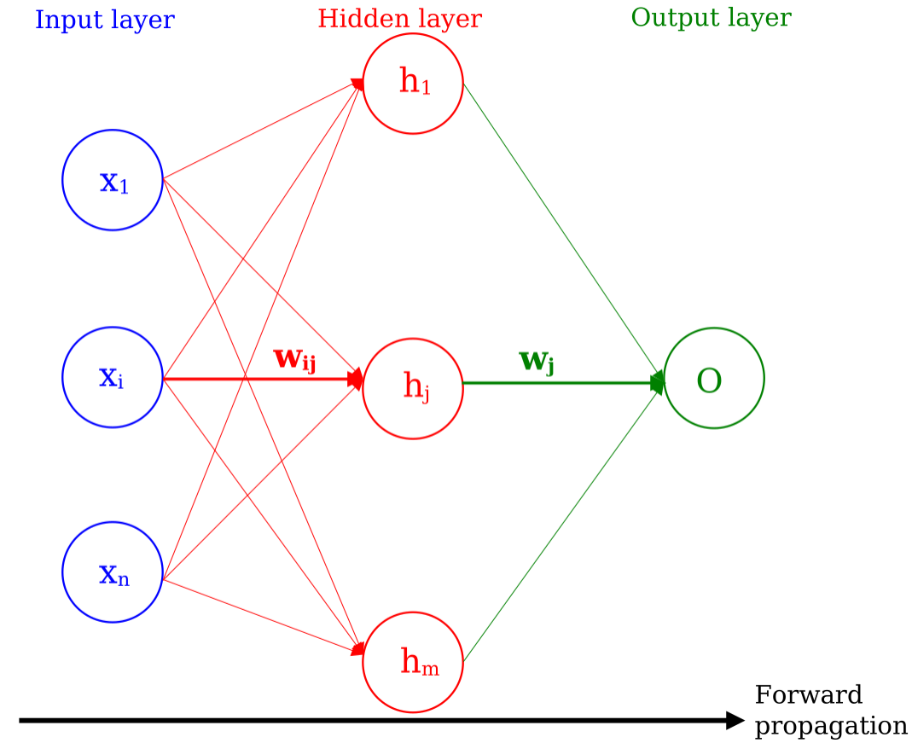
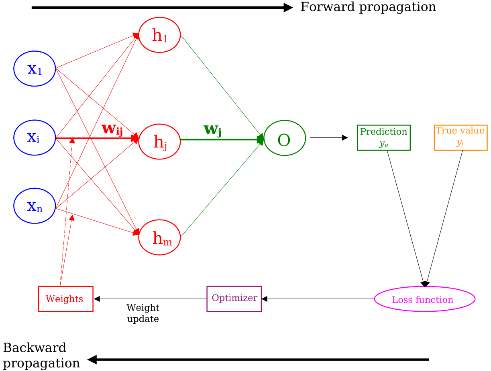

---
The basics of a NN
---
In this section, we will cover the basic concepts of a Neural Network (NN) classifier. First, we will cover the quantity which is minimized and is guiding the training of a NN, quantity which can also be used by other classifiers. Then we will cover the specifics of a NN classifier, namely its architecture and how one builds its output discriminator as function of the input variables. We will then cover how a NN is trained, and go over the activation functions of a NN. Finally, we will provide code snippets illustrating the mentioned functionalities.

## Loss functions: binary & multi-class

When <b>classifying</b> events, we need to optimize a quantity which quantifies our classification; this quantity can be a loss function. If we are dealing with a binary classification of Signal (S) versus Background (B), we need a measure of how much we have classified signal events as S, and background events as B. The binary cross-entropy, which is one such quantity, is one of the loss functions used for binary studies, and is averaged over N events:

$$\
\begin{align}
L =  - \frac{1}{N} \times \Sigma_{i=1}^{N} [ z(i) \times ln(y(i)) + (1 - z(i)) \times ln(1 - y(i)) ] & (1) &,
\end{align}
\$$

where:
* $z(i)$ is the true classification: it is 1 for S, and 0 for B; this can be viewed as the <b>tag</b> of the event, ie. the prior knowledge that we provide to the classifier for this latter to know which event is S or B.
* $y(i)$ is the classifier's output, with its value between 0 and 1, ie. its <b>prediction</b> for whether an event is S(1) or B(0).

$L$ is reflective of the morphology of the classifier: the measure of the classification, itself a function of the separation achieved by the classifier. In equation (1), the first and second terms are "signal" and "background" term respectively. Indeed:

* $$\ L = \frac{1}{N} \times \Sigma_{i=1}^{N} ln(y(i)). \$$ If the prediction is S: $y(i) → 1$, then we have $L → 0$.
* $$\ L = \frac{1}{N} \times \Sigma_{i=1}^{N} ln(1 - y(i)). \$$ If the prediction is B: $y(i) → 0$, then we have $L → 0$.

The general, ie. multi-class, cross-entropy is given by:

$$\
\begin{align}
L =  - \frac{1}{N} \times \Sigma_{i=1}^{N} [ \Sigma_{j=1}^{m} z_j(i) \times ln(y_j(i)) ] & (1') &,
\end{align}
\$$

where $j$ is the index of $m$ different classes. Eq. (1) is easily obtained by considering $m=2$, and considering that for each event $i$, we have $z_1 + z_2 = 1$ and $y_1 + y_2 = 1$.

It has to be noted that Keras, an open-source library in Python for artificial neural networks, minimizes a slightly different loss function. For example, for binary classification, the cross-entropy that Keras minimizes is given by:

$$\
\begin{align}
L_K = - \frac{1}{N} \times \Sigma_{i=1}^{N} wi \times [ z(i) \times ln(y(i)) + (1 - z(i)) \times ln(1 - y(i)) ] & (2) & ,
\end{align}
\$$

where $w_i$ is the event weight, reflecting the number of events in the sample, cross section, etc; it takes into account the (signal and background) samples, both in their shape (through bins of a distribution) and normalization. Therefore, to have a numerically balanced problem to solve, the weights should be made to be comparable:

$$\
\begin{align}
\Sigma_{i=1}^{N} w_i^S = \Sigma_{i=1}^{M} w_i^B & (3) &.
\end{align}
\$$

We will cover more this latest aspect in the subsection "Event balancing". Finally, it should be noted that for NNs performing tasks other than classification, loss functions different from cross-entropy are minimized. For example, for the case of a NN performing a regression, the minimized loss function is often the Mean Squared Error.

## Architecture & weights

In a NN, the information of the n input variables xi is propagated to different nodes as illustrated in figure 1, where we represent a NN with one hidden layer of m nodes. The information is propagated from the input nodes to the output node(s) via the hidden layer(s), representing the foward propagation of the NN. In this example, there is only output node. In the case of a multi-class NN, there is as much nodes as classes for classification.

> # Figure 1
> 

Here, each input node $i$ sends the same input variable $x_i$ to all nodes of the hidden layer. Overall, the NN is fully connected, meaning that each node of a given layer has a connection with all nodes of the subsequent layer. The lines, ie. the numerical connections, between the nodes are the weights $w$, all different from one another, and are updated during the training of the NN (see section on learning). Higher/Lower weights indicate a stronger/weaker influence of one neuron on another. The hidden layers of the NN can be viewed as functions of the variables/nodes of the previous layer.

In the case of a NN with one hidden layer, the output discriminant $y$ of a NN at the output layer is given as a function of input variables $x_i$:

$$\
\begin{align}
y = \Sigma_j^{N_{nodes}} [ g(\Sigma_i^{N_{inputs}} w_{ij} \times x_i) \times w_j ] + O & (4) &,
\end{align}
\$$

where $w_{ij}$ is the weight between node $i$ of a layer and node $j$ of another layer, $w_j$ is the weight between node $j$ of penultimate layer and the output. $g$ is the activation function (see section on activation functions) operating at each node $h_j$ of the hidden layer. As such, y retains the information about the input variables plus a set of weights optimized to minimize the cross-entropy loss.

## Learning/Training of a NN

> # Figure 2
> 

### Gradient descent

### Adam

### Regularization

## Activation functions

## Number of epochs, batch size

## Code snippets
