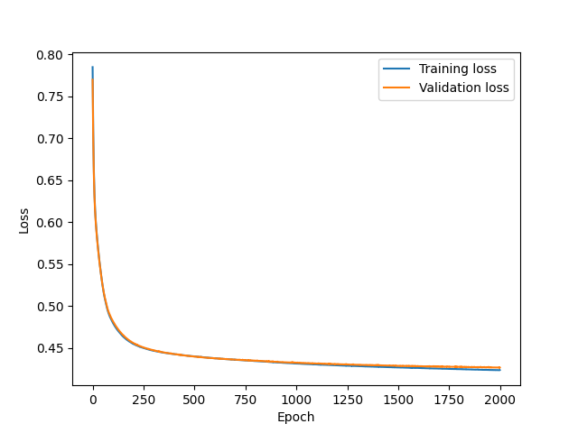
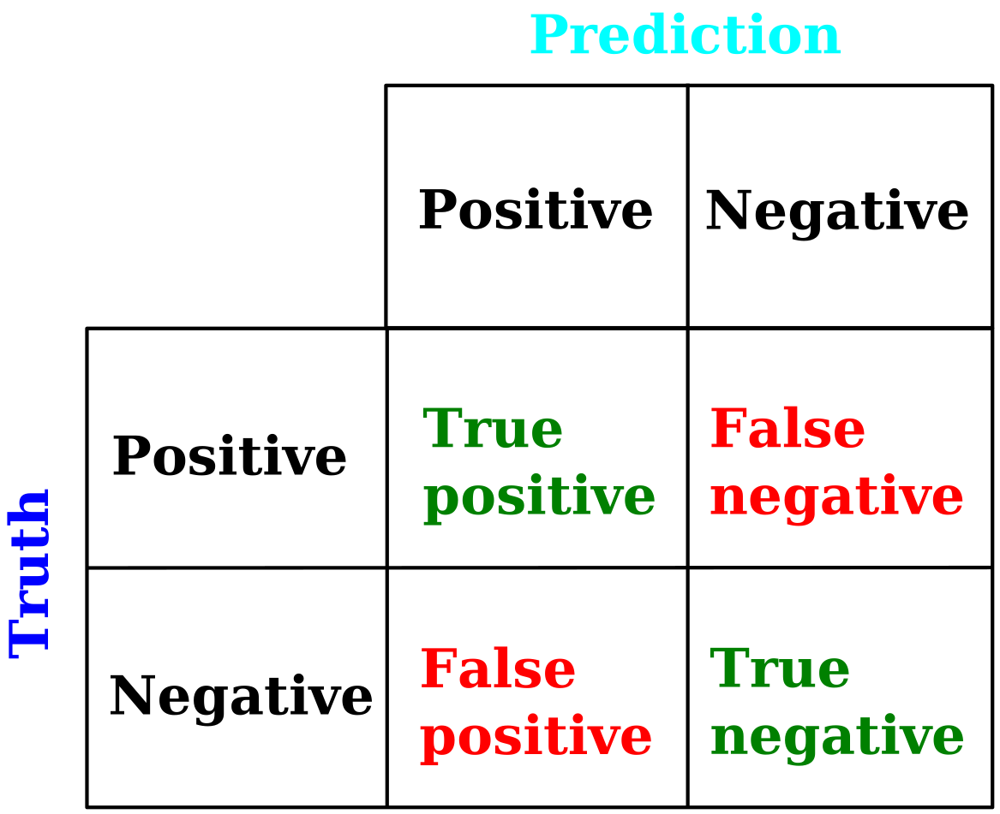
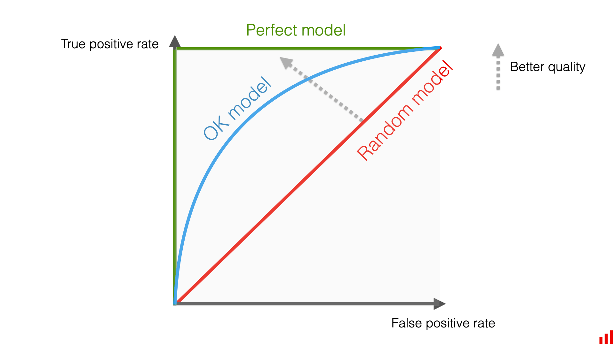
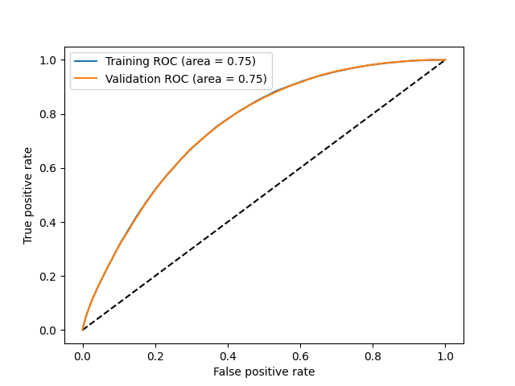
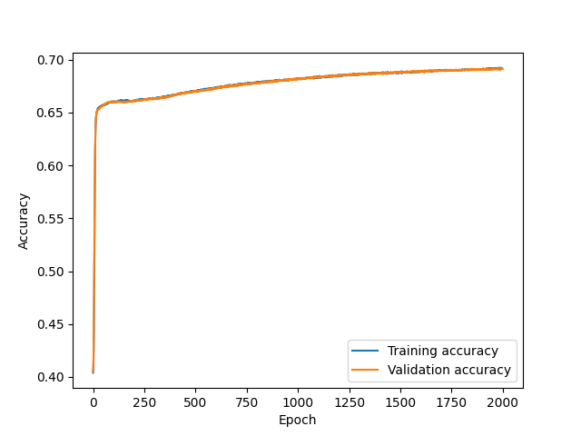
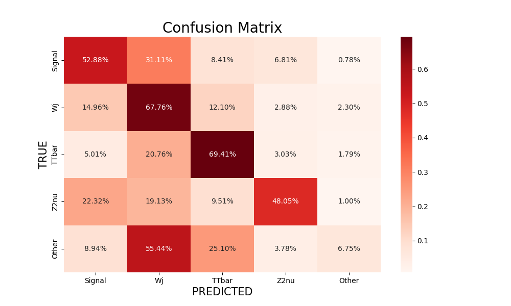
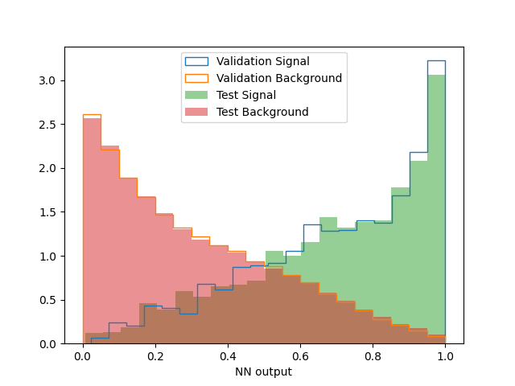

---
Metrics
---

Various metrics exist in order to quantify the performance, and check the sanity of a NN. Below are the main ones.

## Training & Validation losses versus epoch

The training of the NN by definition minimizes the loss, so this latter should decrease versus the epochs for events used for training. So the calculated loss in the validation sample where the weights, as calculated for a given epoch, should have the effect of decreasing the loss in a sample non-exposed to the training. However, a training is never perfect and the loss will never reach nil. As a result, and after a number of epochs, the losses will reach and remain at a minimal and non-zero value. A typical good and realistic example of how training and validation losses should be is given in the plot below: both training and validation losses decrease and plateau after a while, and the validation loss is superior or equal to the training loss, as we do not expect the same weights to yield a better result in the validation sample than for the training sample itself.

> # Figure 5
> 

The following situations are cases where one should pay attention or pitfalls:

* <b>The training & validation losses are increasing after having reached a minimum</b>. This can happen when, ie. from an epoch, the NN is over-fitting the data. In such a case, collecting the weights of the NN at the end of the training will not be optimal, as they will correspond to a case where the loss function isn't minimal, resulting in an under-performing NN. In such a case, as illustrated above, one can/should collect the weights of the epoch where the validation loss is at its minimum.
* <b>Validation loss smaller than training loss</b>. There can be 3 reasons why this can happen.
   * Regularization is applied during training, but not during validation. Regularization leads to a set of weights which generalize better, ie NN results which are more stable for different samples, but also to slightly lower classification performance (eg. higher loss, lower accuracy).
   * Depending on the software used, the training loss can be calculated at the end of each batch and then averaged over all batches of a given epoch, while the validation loss after a full epoch. In such a case, the validation loss is calculated over the full validation set (all batches), without updating at the end of each batch. For example, the default option in Keras is to return the training loss as averaged over the individual batch losses.
   * The validation can be easier (to learn) than the training sample. This can happen if the validation and training sample are not formed from the same dataset, or if, for any reason, the validation data isn't as hard to classify as the training data. This can also happen if some training events are also mixed in the validation sample. If the code creating the training, validation and testing samples splits them correctly, from the same dataset, these shouldn't happen.

## True/False positive/negative

In a binary classification, each event is either in one or the other class, classes that we call "positive" and "negative" (eg. S or B). And each event is predicted to be in one of these two classes by the NN. We can define a confusion matrix which gives the fraction of each true category as classified in a predicted class, see the figure below. Obviously, the more diagonal is this matrix, the better is the classification of the NN; we will cover a quantitative measure of the entire matrix in the subsequent section.

> # Figure 6
> 

A criterion for a good classifier can be to maximize the fraction of true positive events (ie. S events classified as S) while also minimizing the false positive (ie. B events classified as S). We can report the rate of each of these events for various cuts on the NN output, as illustrated in the figure below. With this criterion, the classification power of the NN is optimal when the curve the peaks as much as possible to the top-left corner of this plot (green curve). In the opposite case, when the classifier produces as much true positive as false positive, it means that it does not have any classification power (red curve). A classifier whose curve lies between these limits is fine, but again, the closer it gets to the top-left corner, the better.

> # Figure 7
> 

A quantitative measure of this "peaking" by the area under the (roc) curve, is reported in the figure below: the greater is this area, the better is the classification.

> # Figure 8
> 

## Accuracy versus epoch

> # Figure 9
> 

## Multi-class NN: confusion matrix

> # Figure 10
> 

## Over-training

> # Figure 11
> 

## Assess performance of classification in analysis

## Code snippets
